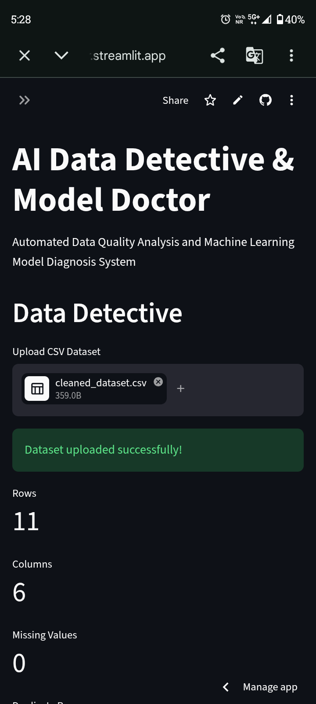
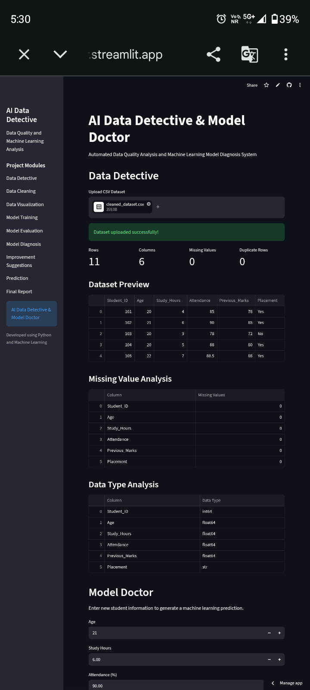
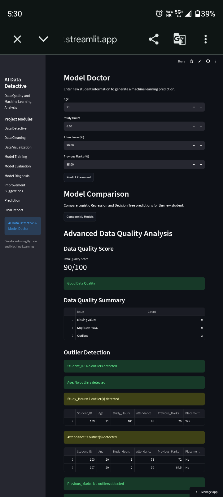
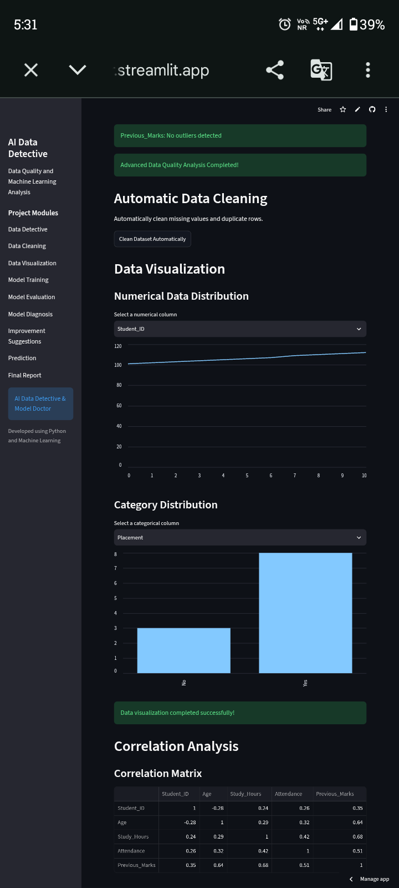
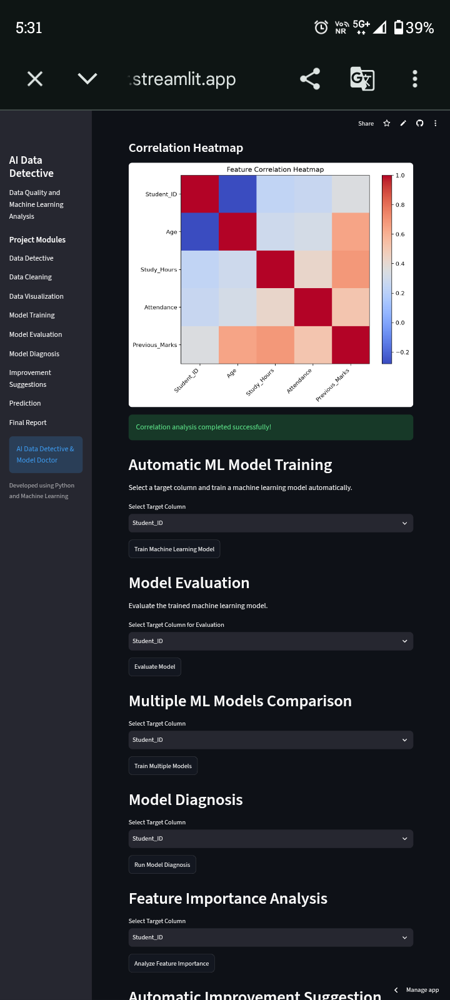
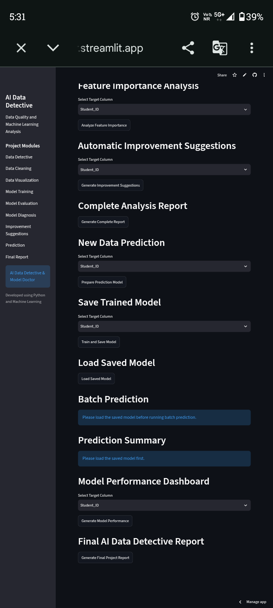

# AI-Data-Detective-Model-Doctor
Automated Data Quality Analysis and Machine Learning Model Diagnosis System
readme_content = """
# AI Data Detective & Model Doctor

## Project Overview

AI Data Detective & Model Doctor is an automated Data Science and Machine Learning system that analyzes datasets, detects data quality problems, cleans the data, trains machine learning models, evaluates model performance, and provides improvement suggestions.

## Objectives

- Detect missing values
- Detect duplicate records
- Detect invalid data types
- Detect numerical outliers
- Analyze class distribution
- Perform correlation analysis
- Automatically clean datasets
- Train multiple machine learning models
- Evaluate model performance
- Detect possible overfitting
- Analyze feature importance
- Generate improvement suggestions
- Perform new data prediction
- Perform batch prediction
- Generate downloadable reports

## Technologies Used

- Python
- Pandas
- NumPy
- SciPy
- Scikit-learn
- Matplotlib
- Plotly
- Joblib
- Streamlit
- Google Colab
- GitHub

## Main Modules

### 1. Data Detective

The Data Detective module analyzes the uploaded dataset and identifies:

- Missing values
- Duplicate rows
- Duplicate IDs
- Invalid values
- Data types
- Outliers
- Class imbalance
- Correlations
- Data quality score

### 2. Automatic Data Cleaning

The system automatically handles:

- Missing numerical values
- Missing categorical values
- Duplicate records
- Invalid numerical values

### 3. Model Doctor

The Model Doctor module performs:

- Data preprocessing
- Feature transformation
- Model training
- Model evaluation
- Cross-validation
- Overfitting detection
- Feature importance analysis
- Improvement suggestions

### 4. Machine Learning Models

The project supports:

- Logistic Regression
- Decision Tree
- Random Forest

## Model Evaluation

The system evaluates machine learning models using:

- Accuracy
- Precision
- Recall
- F1-Score
- Confusion Matrix
- Cross-Validation

## Prediction Features

The application supports:

- Single record prediction
- Batch CSV prediction
- Prediction confidence
- Prediction result visualization
- Downloadable prediction reports

## Data Quality Score

The project includes a custom Data Quality Score based on detected data issues such as:

- Missing values
- Duplicate rows
- Numerical outliers

This score is a project-defined quality indicator and is not an industry-standard metric.

## Project Workflow

CSV Upload → Data Analysis → Data Cleaning → Feature Processing → Model Training → Model Evaluation → Model Diagnosis → Prediction → Report Generation

## Streamlit Application

The project provides an interactive Streamlit dashboard where users can upload datasets, analyze data quality, train models, perform predictions, and generate reports.

## Project Structure

AI_Data_Detective_Model_Doctor/

- app.py
- trained_model.pkl
- logistic_regression_model.pkl
- decision_tree_model.pkl
- feature_scaler.pkl
- cleaned_dataset.csv
- AI_Data_Detective_Report.csv
- README.md

## How to Run

Install the required libraries:

```bash
pip install pandas numpy scipy scikit-learn matplotlib plotly joblib streamlit

## Project Screenshots

### Data Quality Analysis



### Data Analysis



### Model Evaluation



### Model Diagnosis



### Prediction Result



### Final Project Report


